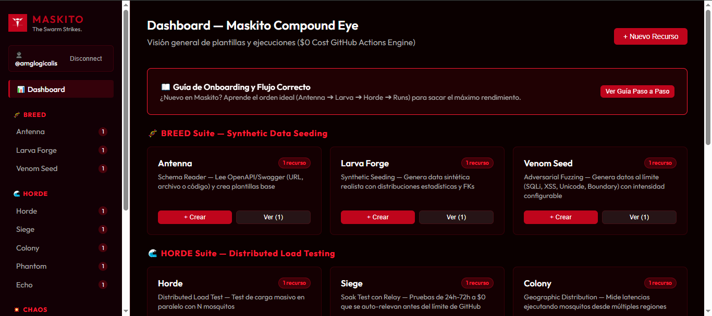
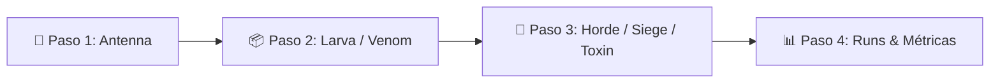

<div align="center">
  
  <h1>MASKITO</h1>
  <p><strong>The Swarm Strikes. Zero Cost. Maximum Pressure.</strong></p>
  <p>
    <a href="https://amglogicalis.github.io/maskito-repo-public/"></a>
    
    
    
    
  </p>
  <p><em>Massive stress testing &amp; synthetic data seeding engine running entirely on GitHub Actions at $0 cost.</em></p>
</div>

---

## 🌐 Consola Web Online & Live Preview

Maskito incluye una **Consola Web moderna en Dark Mode con arquitectura Glassmorphism** (color primario `#bf051c`) que te permite crear, personalizar e inyectar workflows directamente a cualquier repositorio GitHub con 1 solo clic.

👉 **[Abrir Consola Web Online desplegada en GitHub Pages](https://amglogicalis.github.io/maskito-repo-public/)**

<div align="center">
  
</div>

---

## 💡 ¿Qué es Maskito?

Maskito es un motor nativo para **GitHub Actions a $0 coste** diseñado para ejecutar pruebas de esfuerzo masivas, siembra de datos sintéticos e ingeniería de caos sin pagar infraestructura ni servidores externos.

Un mosquito es una molestia. Un **enjambre de mosquitos** paraliza un sistema. Maskito distribuye la carga entre $N$ mosquitos (runners paralelos de GitHub Actions) de forma totalmente controlada y reproducible.

---

## 🚀 Flujo Recomendado de Uso (Step-by-Step Workflow)

Para obtener los mejores resultados en tu arquitectura, se recomienda seguir el siguiente orden:



1. **Paso 1 — Antenna (Schema Reader)**: Carga tu especificación OpenAPI/Swagger por URL, subiendo un archivo o pegando código. Antenna detecta tus entidades y genera la plantilla base.
2. **Paso 2 — Larva Forge & Venom Seed (Data Seeding & Fuzzing)**: Usa Larva Forge para sembrar miles de registros sintéticos en tu base de datos o Venom Seed para generar cargas de fuzzing maliciosas (SQLi/XSS).
3. **Paso 3 — Horde / Siege / Toxin (Ataque de Enjambre & Caos)**: Configura pruebas de carga simultáneas (Horde), pruebas de resistencia de 48h con auto-relevo (Siege) o inyección de caos (Toxin/Epidemic/Cascade).
4. **Paso 4 — Inyección & Runs (Monitorización Live)**: Inyecta el archivo `.github/workflows/maskito-*.yml` a tu repo con 1 clic y monitoriza métricas (P50/P95, Throughput, Logs) en tiempo real desde **Runs**.

---

## 🛠️ Catálogo Completo de las 12 Funciones

### 🧬 BREED Suite — Generación de Datos & Fuzzing
* **🧬 Antenna (Schema Reader)**: Analiza especificaciones OpenAPI/Swagger y genera plantillas `.yaml` estándar de tus modelos de datos.
* **📦 Larva Forge (Synthetic Data)**: Genera datasets sintéticos realistas con distribuciones estadísticas (Gaussiana, Poisson, Enum) y reglas de claves foráneas (FK).
* **💉 Venom Seed (Adversarial Fuzzing)**: Genera payloads de prueba al límite (SQL Injection, XSS, Unicode/Emojis, Boundary Values y cabeceras malformadas).

### 🌊 HORDE Suite — Pruebas de Carga & Rendimiento
* **🌊 Horde (Distributed Load Test)**: Test de carga masivo en paralelo con $N$ mosquitos atacando endpoints simultáneamente.
* **⏱️ Siege (Soak Test con Relay)**: Pruebas de resistencia sostenidas de 24h a 72h a $0 coste que se auto-relevan vía GitHub API antes del límite de 6h por Action.
* **🌍 Colony (Geographic Distribution)**: Ejecuta mosquitos en múltiples regiones de runners comprobando latencias geográficas reales.
* **👻 Phantom (Browser Load Test)**: Levanta navegadores Playwright (Chromium/Firefox) reales bajo carga para detectar fallos JS y degradado visual DOM.
* **📋 Echo (Traffic Replay)**: Sube o enlaza archivos de logs reales (Nginx/S3) para reproducir patrones de tráfico de producción contra entornos de staging.

### 💥 CHAOS Suite — Ingeniería de Caos
* **☠️ Toxin (Chaos Injection)**: Inyecta rangos de latencia configurable en ms, peticiones corrompidas (Gremlins) o caídas de dependencias (Blackout).
* **☣️ Epidemic (Chaos Swarm)**: Enjambre mixto con roles asignados por % (ej: 60% tráfico normal, 20% latencia, 10% datos maliciosos, 10% blackout).
* **🕸️ Cascade (Cascade Failure Mapping)**: Simula la caída en cadena de microservicios sobre un cluster base y mapea la velocidad de propagación del fallo.

### 🎯 HUNTER Suite — Flujos Stateful Avanzados
* **🎯 Hunter (Stateful User Journey)**: Simula navegaciones reales multi-paso (Login ➔ Token JWT ➔ Carrito ➔ Pago) manteniendo la sesión de usuario activa entre pasos.

---

## ⚖️ Responsabilidad Legal & Uso Ético (Legal Disclaimer)

> [!WARNING]
> **IMPORTANTE — TECNOLOGÍA DE DOBLE USO**: Maskito es una herramienta de auditoría de rendimiento e ingeniería de caos diseñada **exclusivamente para entornos de staging, pre-producción e infraestructuras de tu propiedad o expresamente autorizadas**.
> 
> El uso no autorizado de Maskito para lanzar ataques de Denegación de Servicio (DoS/DDoS de Capa 7) o fuzzing contra servidores de terceros constituye una violación grave de las leyes de ciberseguridad y de los **Términos de Servicio de GitHub (TOS)**.
>
> El usuario final asume el **100% de la responsabilidad legal, penal y ética** derivada del uso de este software.

---

## ⚡ Inyección Directa a Repositorios GitHub

La Consola Web cuenta con el botón **`⚡ Inyectar a Repo GitHub`** en todas las vistas de workflow. Con tu Personal Access Token (PAT), la consola inyecta automáticamente el archivo `.github/workflows/maskito-*.yml` en la carpeta `.github/workflows/` de tu repositorio sin necesidad de realizar commits manuales por consola.

---

## 💻 CLI & SDK Integration

### Instalación del CLI

```bash
npm install -g terra-maskito
```

### Inicialización de la Bóveda de Almacenamiento

```bash
export GITHUB_TOKEN=ghp_tupersonalaccesstoken
maskito init
```

### Comandos de Ejemplo CLI

```bash
# Parsear Schema
maskito breed antenna --spec openapi.json

# Generar Data Sintética
maskito breed larva --config seed.yaml --format json

# Ejecutar Test de Carga
maskito horde run --config maskito.yaml

# Iniciar la Consola Web Localhost (puerto elegible)
maskito console --port 7410
```

---

## 📄 Licencia

Desarrollado bajo licencia **MIT** dentro del ecosistema [Terra](https://github.com/amglogicalis/Terra).
